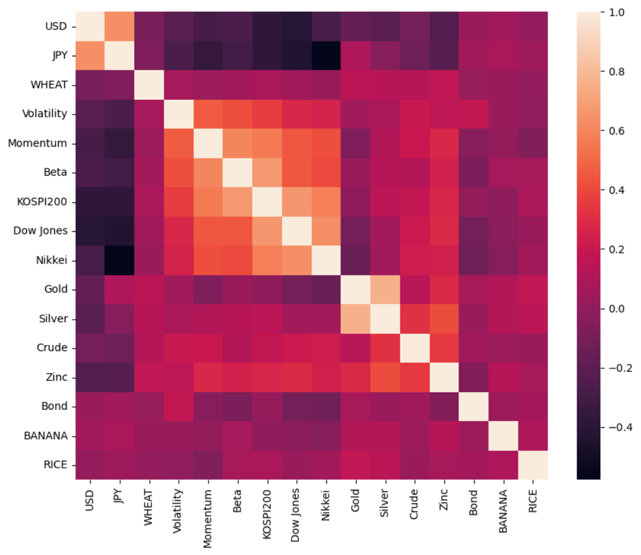
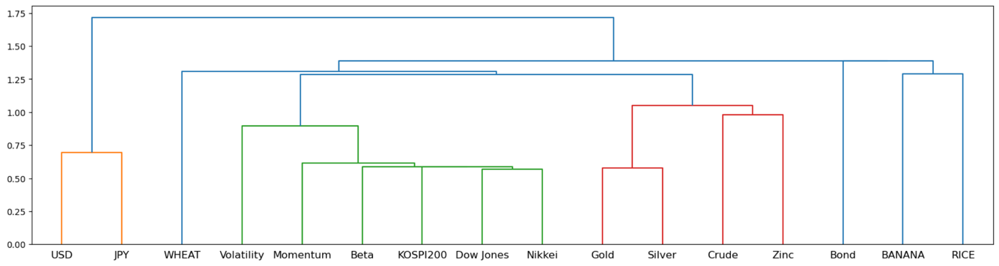
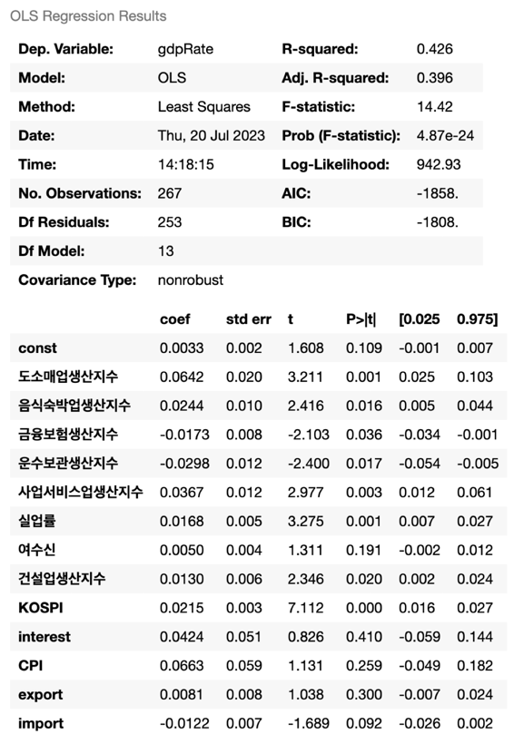
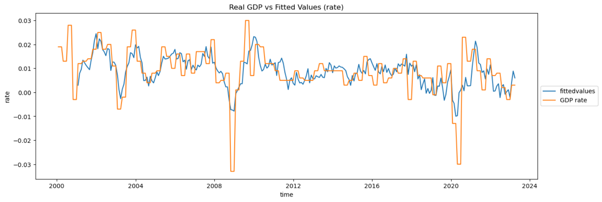
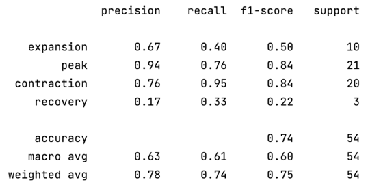
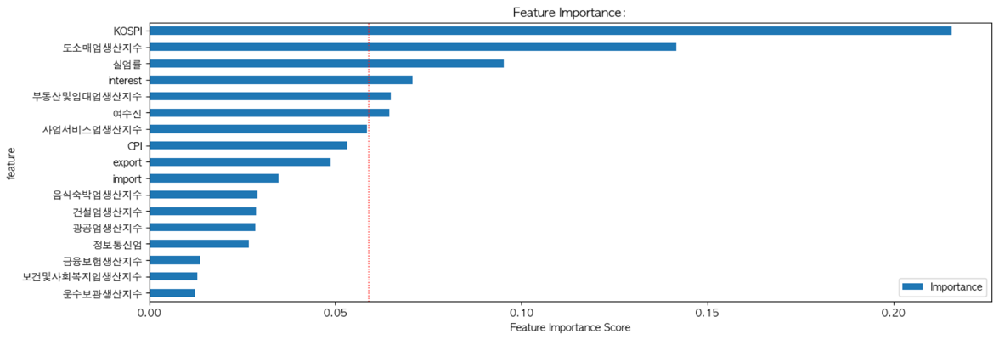
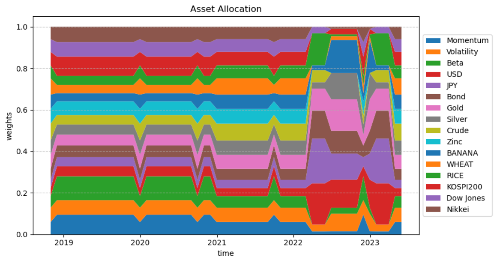
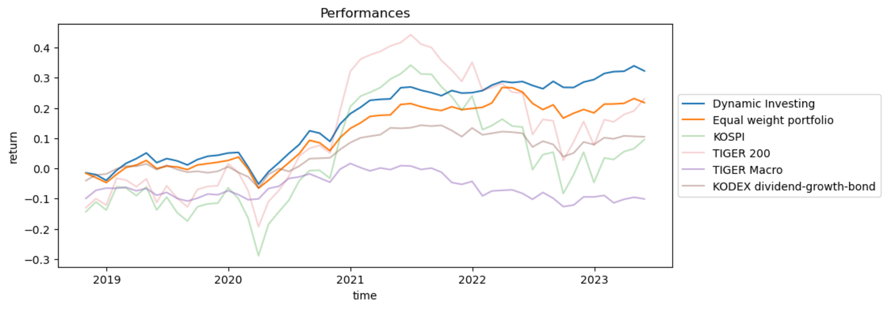
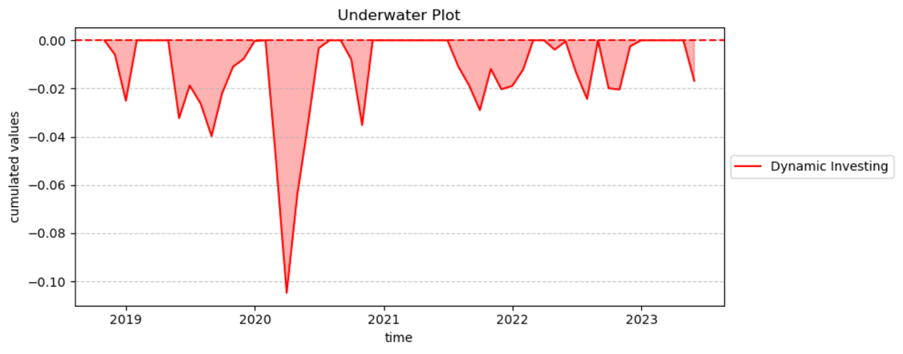
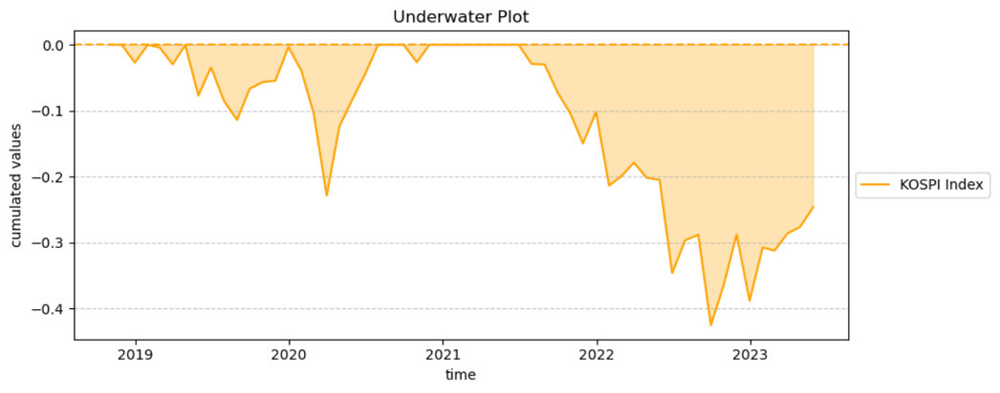

# Dynamic-Investing
Dynamic Investing strategy with nowcasting

## Project blueprint
FIND-A의 final project로 진행된 프로젝트입니다. 대략적인 구성은 다음과 같습니다.
1. Investment Universe 지정
2. Macroeconomic 데이터를 활용한 Nowcasting machine learning 모형 개발
3. 추정된 국면을 이용한 목표 수익률 지정
4. 목표 수익률과 추정된 연간 자산군 사이의 공분산을 이용한 Portfolio 제작
5. Nowcasting view를 이용한 Black Litterman Optimization 수행
6. 성과 분석

### Investment Universe
투자 자산으로는 다음과 같은 자산을 추가하였습니다.

**Stocks**
- Low Volatility
- Market Beta
- Momentum
- KOSPI200 Future

**Bond**
- Korea 10Y

**Currencies**
- KRW/USD
- KRW/JPY

**Commodities**
- Gold
- Silver
- Crude Oil
- Zinc 
- Banana
- Rice
- Wheat

**Foreign**
- Nikkei 225
- Dow Jones

각 자산군의 계층별 리스크를 고려한 Inverse PCA 상관관계는 다음과 같습니다.

### Nowcasting Model
먼저, 다중회귀모형을 이용하여 유의한 변수를 선택합니다

CPI와 수출액 변동율을 이용하여 경기 국면을 labeling 합니다
- CPI<0.04, 수출증가율>0 : 호황
- CPI<0.04, 수출증가율<0 : 후퇴
- CPI>0.04, 수출증가율>0 : 회복
- CPI>0.04, 수출증가율<0 : 불황

Random Forest 분류기를 이용해 test기간의 경기국면을 예측합니다

Random Forest 분류기를 사용하면 다음과 같이 특성 중요도 또한 확인이 가능합니다

### Black Litterman Model

- 목표 수익률 : Train 기간(2001/01 - 2018/09) 경기국면별 평균 수익률 + 20%
- Covariance Matrix : 투자시점 기준 과거 1년간의 추정치 사용

### Performances

- Expected Return: 0.0691
- Risk (Standard Deviation): 0.0219
- Yearly Sharpe Ratio: 1.5527
- Max MDD: -0.1048
- CAGR: 0.0617